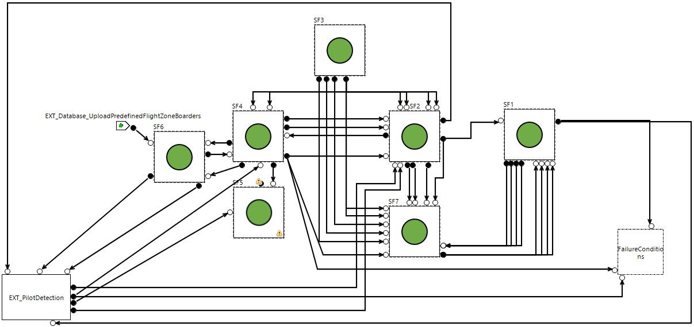

# AIDA - Functional MBSA model

  
_AIDA system overview_

## Source

AIDA use-case on IRT Saint-Exupéry [public platform](https://sahara.irt-saintexupery.com/AIDA)

## Key features

This project emphasizes the following SimfiaNeo features:

* [Hierarchical views](#hierarchical-views)
* [Project Library](#project-library)
* [Colors](#colors)
* [Sequences generation](#sequences-generation)
* [Post-treatment of sequences](#post-treatment-of-sequences)

## Detailed description

The AIDA system aims at assisting the pre-flight inspection of commercial aircrafts. It consists of a drone that carries a camera, a remote control and a control desk. System models and associated documentation are available here: [https://sahara.irt-saintexupery.com/AIDA/AIDAArchitecture](https://sahara.irt-saintexupery.com/AIDA/AIDAArchitecture)

### Hierarchical views

Models can be structured in bricks, sub-bricks, sub-sub-bricks... This is useful to ease readability, but also to organize the system in a similar way than input design data. This model has 1 to 4 layers.

User manual sections:

* Build your model - System diagram - Bricks

### Project Library

This model includes several identical functions and subsystems. These bricks are defined in the Library.  
Other bricks do not need to be in the Library as they are unique. Choice was made to put them as single-use.  

User manual sections:

* Use a library - Project library

### Colors

In order to improve step-by-step simulation readability, user-defined colors have been created to be used in the study. These colors are accessible through the Colors table and then applied through the Domains table.

User manual sections:

* Build your model - Define colors
* Build your model - Define domains

### Sequences generation

This study is about finding succession of failures leading to feared situations. These feared situations are defined as Observers in the Observers table.  
As we know this model to be dynamic, sequences are requested. Study is made only qualitatively, so no probability computation is requested. Computation options are defined in the sequences configurations table.

User manual sections:

* Build your model - Define observers
* Computations - Generate cuts/sequences

### Post-treatment of sequences

SimfiaNeo includes functionalities to help analyze generated results. In this study, generated sequences have been post-treated to hide the pilot action (as this is not a failure) and group sequences which are equivalent to cuts. This is managed through the _Rule_ tab of computation results.

User manual sections:

* Computations - Generate cuts/sequences - Post-treatment of results

## Licensing information

The whole content is provided under the following terms

Copyright (c) 2024 AIRBUS Protect SAS

All rights reserved. This program and the accompanying materials are made available under the terms of the  Creative Commons Attribution-ShareAlike 4.0 International (CC BY-SA 4.0) which accompanies this distribution, and is available at [https://creativecommons.org/licenses/by-sa/4.0/](https://creativecommons.org/licenses/by-sa/4.0/)

Copyright (c) 2016-2022 IRT AESE (IRT Saint Exupéry).

All rights reserved. This program and the accompanying materials are made available under the terms of the  Creative Commons Attribution-ShareAlike 4.0 International (CC BY-SA 4.0) which accompanies this distribution, and is available at [https://creativecommons.org/licenses/by-sa/4.0/](https://creativecommons.org/licenses/by-sa/4.0/)

Third party components:

The nodes Functions/BasicOperators/AND, Functions/BasicOperators/Comparator, Functions/BasicFunctions/InOutFunction and  Functions/BasicFunctions/SourceFunction are provided under the following terms:

Copyright (c) 2007-2022 ONERA.

All rights reserved. This program and the accompanying materials  are made available under the terms of the Creative Commons Attribution-ShareAlike 4.0 International (CC BY-SA 4.0) which accompanies this distribution, and is available at [https://creativecommons.org/licenses/by-sa/4.0/](https://creativecommons.org/licenses/by-sa/4.0/)