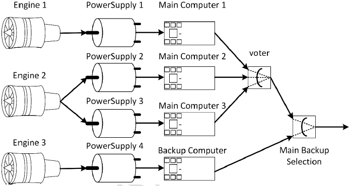

# ARP4761 Second MBSA example - Control system

  
_Control system overview_

## Source

[ARP4761A Guidelines and Methods for Conducting the Safety Assessment Process on Civil Airborne Systems and Equipment](https://www.sae.org/standards/content/arp4761a/ "SAE website")  
Appendix N - Model Based Safety Analysis (MBSA)

## Key features

This project emphasizes the following SimfiaNeo features:

* [Project Library](#project-library)
* [Constants](#constants)
* [Truth table](#truth-table)
* [Cuts generation](#cuts-generation)
* [Post-treatment with user data](#post-treatment-with-user-data)

## Detailed description

The modeled system is a basic control system used to generate a command. Due to the risk of having an erroneous or lost command, several redundancies are implemented in its architecture. The aim of this study is to generate cuts leading to the feared situations.

  

_Model overview_ 

### Project Library

This model includes several identical equipment (3 engines, 4 power supplies, 4 computers). These bricks are defined in the Library. Failure rates are directly defined in the Library. Since Backup Computer has different failure rates, its values are redefined directly on its instance.  
Voter and Switch do not need to be in the Library as they are unique. Choice was made to put them as single-use.  

User manual sections:

* Use a library - Project library

### Constants

Recommended practice is to use Constants to define the numerical values in the model, in particular failure rates. Constants are created in the Constants table, before being applied on classes and/or instances.

User manual sections:

* Build your model - Define constants

### Truth table

Voter brick is a purely logical element. It combines values from its 3 inputs to output only one value. As a consequence, it is interesting to use a Truth table to validate its implementation.

User manual sections:

* Verify and validate your system - Truth tables

### Cuts generation

This study is about finding combinations of failures leading to feared situations. These feared situations are defined as Observers in the Observers table.  
As we know this model to be static, it is possible to directly request for cuts instead of sequences. Computation options are defined in the sequences configurations table.

User manual sections:

* Build your model - Define observers
* Computations - Generate cuts/sequences

### Post-treatment with user data

SimfiaNeo includes functionalities to help analyze generated results. This model includes a user data to indicate equipment suppliers. These user data values do not modify the model behavior, but are used in Checks of computation configurations. Cuts are automatically analyzed to detect the ones containing common points in the view of suppliers.

User manual sections:

* Build your model - Define user data
* Computations - Generate cuts/sequences - Post-treatment of results

## Licensing information

The whole content is provided under the following terms

Copyright (c) 2024 AIRBUS Protect SAS

All rights reserved. This program and the accompanying materials are made available under the terms of the 
Creative Commons Attribution-ShareAlike 4.0 International (CC BY-SA 4.0) which accompanies this distribution,
and is available at [https://creativecommons.org/licenses/by-sa/4.0/](https://creativecommons.org/licenses/by-sa/4.0/)
