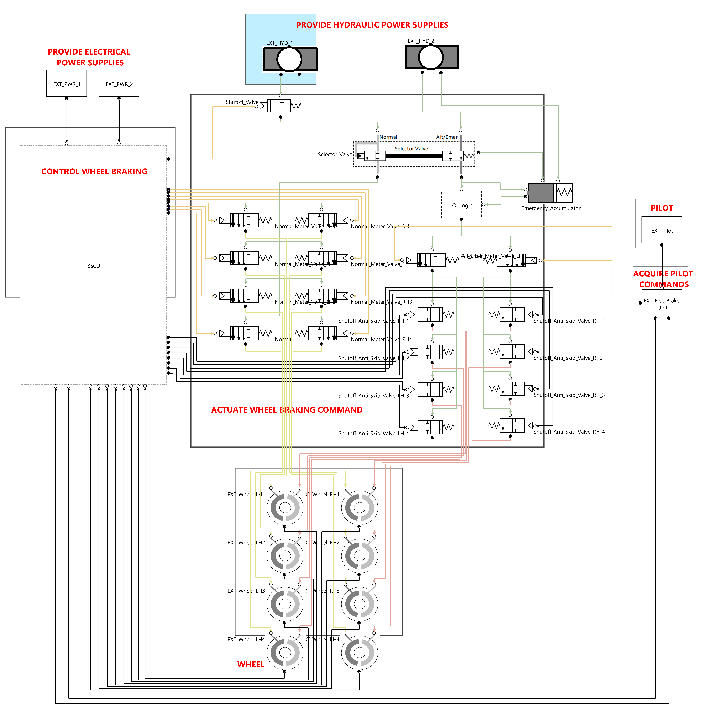

# ARP4761 S18 Aircraft Wheel Brake System

## Source

[ARP4761A Guidelines and Methods for Conducting the Safety Assessment Process on Civil Airborne Systems and Equipment](https://www.sae.org/standards/content/arp4761a/ "SAE website")

Appendix Q.9 - S18 Airplane - Wheel Brake System PSSA example using Model-Based Safety Assessment (MBSA)

## Key features

This project emphasizes the following SimfiaNeo features:

- [Hierarchical views](#hierarchical-views)
- [Project Library](#project-library)
- [Phases](#phases)
- [Sequences generation](#sequences-generation)
- [Post treatment of sequences](#post-treatment-of-sequences)

## Detailed description

The modeled system is a high-level view of the wheel brake system. It includes functions to be realized by the WBS and relevant failure modes of these functions. The aim of this study is to generate sequences leading to the feared situations. 

### Hierarchical views

Models can be structured in bricks, sub-bricks, sub-sub-bricks... This is useful to ease readability, but also to organize the system in a similar way than input design data. This model has 1 to 2 layers.

User manual sections:

- Build your model - System diagram - Bricks

### Project library

This model includes several identical equipment (2 external hydraulic systems - Each composed of a Hydraulic power unit and an isolation valve, 8 Meter Valves, 8 Shutoff antiskid valves, 2 Emergency meter valves, 2 internal power units, 2 BSCU command units, 2 External power units, and 8 wheel systems - each composed of a Wheel and a Speed sensor). These bricks are defined in the Library. Failure rates are directly defined in the Library. 

Other bricks do not need to be in the Library as they are unique. Choice was made to put them as single-use.

User manual sections:

- Use a library - Project library

### Phases

This model considers two scenarios of the system, the pilot can be braking or not braking. This is modeled by defining two phases of the system, where the initial state of the EXT_Pilot brick is respectively set to braking and not braking. 

This modeling allows to compute the sequences for both the "Loss of Braking" and "Inadvertent Braking" failure conditions. 

User manual sections:

- Define phases - Define initial state of the system

### Sequences generation

This study is about finding succession of failures leading to feared situations. These feared situations are defined as Observers in the Observers table.  
As we know this model to be dynamic, sequences are requested. Computation options are defined in the sequences configurations table.  

User manual sections:

- Build your model - Define observers
- Computations - Generate cuts/sequences

### Post-treatment of sequences

SimfiaNeo includes functionalities to help analyze generated results. In this study, generated sequences have been post-treated to hide the dirac events, which are direct consequences of another event, and to group sequences when the order of the events is not important.

User manual sections:

- Computations - Generate cuts/sequences - Post-treatment of results

## Licensing information

The whole content is provided under the following terms

Copyright (c) 2024 AIRBUS Protect SAS

All rights reserved. This program and the accompanying materials are made available under the terms of the Creative Commons Attribution-ShareAlike 4.0 International (CC BY-SA 4.0) which accompanies this distribution, and is available at [https://creativecommons.org/licenses/by-sa/4.0/](https://creativecommons.org/licenses/by-sa/4.0/)
