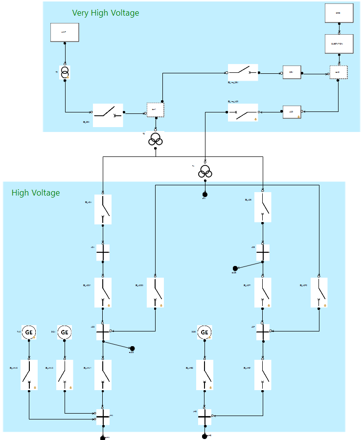

# Emergency power supply of a nuclear power plant

  
_Partial overview_

## Source

[A Benchmark on Reliability of Complex Discrete Systems: Emergency Power Supply of a Nuclear Power Plant](https://www.researchgate.net/publication/315135405_A_Benchmark_on_Reliability_of_Complex_Discrete_Systems_Emergency_Power_Supply_of_a_Nuclear_Power_Plant "Article on ResearchGate")  

## Key features

This project emphasizes the following SimfiaNeo features:

* [Project Library](#project-library)
* [Advanced modeling](#advanced-modeling)
* [Constants](#constants)
* [Layers](#layers)
* [Monte-Carlo simulation](#monte-carlo-simulation)

## Detailed description

The modeled system is an emergency power supply to provide energy to components of a nuclear power plant. This is an electrical system with repairable components, cold redundancies, reconfigurations and common cause failures. The aim of this study is too compute RAMS indicators on missions.

### Project Library

This model includes several identical equipment (circuit-breakers, diesel generators, ...). These bricks are defined in the Library. Failure rates are directly defined in the Library.  
Some bricks do not need to be in the Library as they are unique. Choice was made to put them as single-use.  

User manual sections:

* Use a library - Project library

### Advanced modeling

Linked to having a very dynamic system behavior, most AltaRica features are used in this model, and some equipment in particular are more complex. The _PoweredControlledCircuitBreaker_ might be the most interesting one with:

* two circuit inputs and two circuit outputs, as electrical current can propagate both ways
* a position _open_ or _closed_ modeled via a boolean
* a dysfunctional state for being stuck modeled via a boolean
* an opening or closing linked to internal state and to receiving a command and to being powered and to detecting a short-circuit at one of its circuit inputs
* a failure mode for short-circuit failure
* a failure mode for failing to open (using a bucket)
* a failure mode for failing to close (using a bucket)
* a repair

Apart from this case, the model also uses synchronizations for common cause failures, and Dirac events for reconfigurations. Cold redundancies also make it necessary to configure initial states of each equipment through the Phases table.

User manual sections:

* Build your model - Customize a brick - Behavior tab
* Build your model - Customize a brick - Propagation tab
* Build your model - Customize a brick - Bucket tab
* Build your model - Customize a brick - Synchronizations tab
* Build your model - Define phases
* Appendix - Model with AltaRica

### Constants

Recommended practice is to use Constants to define the numerical values in the model, in particular failure rates. Constants are created in the Constants table, before being applied on classes and/or instances.

User manual sections:

* Build your model - Define constants

### Layers

Complex systems can have many graphical elements in their diagrams with a lot of bricks, connectors and links. In order to help readability in this model, layers have been used to be able to share easily readable views of the systems:

* At the top-level, modeling artifacts (used for computations) have been put in a specific layer _Artifacts_ to be hidden most of the time.
* In sub-diagrams, dedicated layers have been defined to include control-command architecture and backflows. This way, a simplified view of the model as it would be defined in an electrical design schematic can be displayed.

User manual sections:

* Build your model - Define layers

### Monte-Carlo simulation

This study is about computing RAMS indicators. These indicators are defined as Observers in the Observers table.  
Monte-Carlo simulation consists in launching a great number of simulations. Computation options are defined in the stochastic configurations table. Charts of the indicators evolution throughout the mission can also be requested in these options.

User manual sections:

* Build your model - Define observers
* Computations - Perform Monte-Carlo simulations

## Licensing information

The whole content is provided under the following terms

Copyright (c) 2024 AIRBUS Protect SAS

All rights reserved. This program and the accompanying materials are made available under the terms of the 
Creative Commons Attribution-ShareAlike 4.0 International (CC BY-SA 4.0) which accompanies this distribution,
and is available at [https://creativecommons.org/licenses/by-sa/4.0/](https://creativecommons.org/licenses/by-sa/4.0/)
