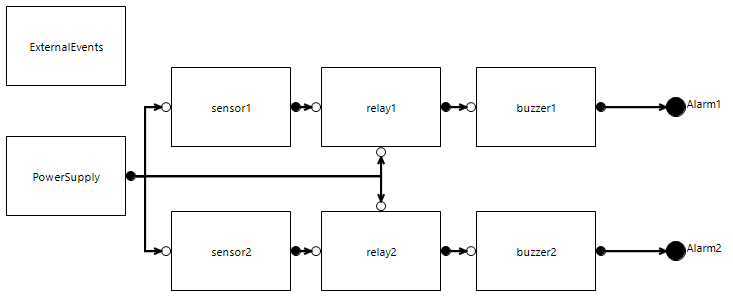

# Fire Detection

  
_System overview_

## Key features

This project emphasizes the following SimfiaNeo features:

* [Project Library](#project-library)
* [Constants](#constants)
* [Cuts generation](#cuts-generation)
* [Post-treatment with user data](#post-treatment-with-user-data)
* [Aeronautical extension](#aeronautical-extension)

## Detailed description

The modeled system is a basic engine fire detection. Due to the risk of losing the alarm, a redundancy is implemented in its architecture. The aim of this study is to generate cuts leading to the feared situations.

### Project Library

This model includes several identical equipment (sensors, relays, buzzers). These bricks are defined in the Library. Failure rates are directly defined in the Library.  
PowerSupply and ExternalEvents do not need to be in the Library as they are unique. Choice was made to put them as single-use.  

User manual sections:

* Use a library - Project library

### Constants

Recommended practice is to use Constants to define the numerical values in the model, in particular failure rates. Constants are created in the Constants table, before being applied on classes and/or instances.

User manual sections:

* Build your model - Define constants

### Cuts generation

This study is about finding combinations of failures leading to feared situations. These feared situations are defined as Observers in the Observers table.  
As we know this model to be static, it is possible to directly request for cuts instead of sequences. Computation options are defined in the sequences configurations table.

User manual sections:

* Build your model - Define observers
* Computations - Generate cuts/sequences

### Post-treatment with user data

SimfiaNeo includes functionalities to help analyze generated results.  
This model includes a user data to indicate channels. These user data values do not modify the model behavior, but are used in Checks of computation configurations. Cuts are automatically analyzed to detect the ones containing common points in the view of channels.  
Other checks have been configured relative to having single failures or meeting safety objectives (see next section)

User manual sections:

* Build your model - Define user data
* Computations - Generate cuts/sequences - Post-treatment of results

### Aeronautical extension

This project includes the aeronautical extension. This means in particular that Functions table, Scenarios table and Failure Conditions table have been filled. These elements are linked to the model and its results, enabling to know from the Failure Conditions table if the safety objectives are met.

User manual sections:

* Apply Aeronautical process
* Apply Aeronautical process - FHA

## Licensing information

The whole content is provided under the following terms

Copyright (c) 2024 AIRBUS Protect SAS

All rights reserved. This program and the accompanying materials are made available under the terms of the  Creative Commons Attribution-ShareAlike 4.0 International (CC BY-SA 4.0) which accompanies this distribution, and is available at [https://creativecommons.org/licenses/by-sa/4.0/](https://creativecommons.org/licenses/by-sa/4.0/)